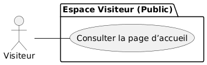
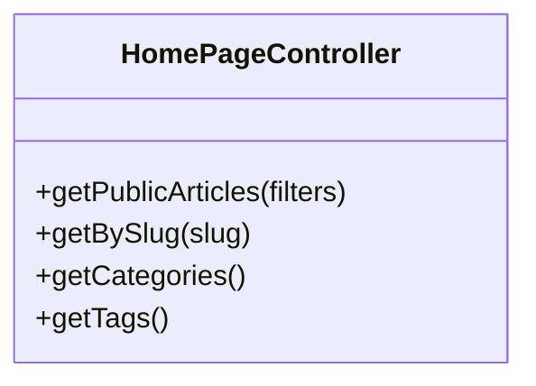

# 📘 Blog Solicode
## Sprint 1: Page Accueil

**Présenté par:** Abdelhay Mallouli
**Encadré par:** Mr. ESSARRAJ FOUAD

---

# 📌 Travail a faire

Créer la **page Accueil** du Blog Solicode

* **Cible :** Créer la **page Accueil**.
* **Workflow :** Git / Github Branching.
* ###  Labs :  *Github Branch*

---

# 📦 Livrables Attendus

A la fin de ce sprint, les éléments suivants seront opérationnels :

1. **Code Source :** Dépôt Laravel structuré.
2. **Frontend :** Page d'accueil fonctionnelle et responsive.
3. **Documentation :** Présentation du Sprint 1 terminée.

---

# 👥 Perspective Utilisateur

--- 

# 🔹 Fonctionnalités

L'accueil repose sur quatre piliers techniques majeurs :

---

# 🚀 Merci pour votre attention !

**Questions ?**
