Alright, let’s get this **Blog Solicode** presentation locked and loaded for Marp. I’ve structured it to be punchy, visual, and direct, using the Mermaid diagrams we just built.

Copy the code below into your Marp-compatible editor (like VS Code with the Marp extension).

---

```markdown
---
marp: true
theme: default
paginate: true
backgroundColor: #fff
header: '📘 Blog Solicode - Sprint 1'
footer: 'Réalisé par Abdelhay Mallouli'
---

# 📘 Blog Solicode
## Sprint 1: Page Accueil
---
**Présenté par:** Abdelhay Mallouli
**Encadré par:** Mr. ESSARRAJ FOUAD

---

# 📌 Objectif du Sprint

L'objectif principal est la mise en place de la structure fondamentale du blog.

* **Cible :** Créer la **page Accueil**.
* **Environnement :** Framework Laravel.
* **Workflow :** Git / Github Branching.

---

# 🧪 Labs & Workflow

```mermaid
graph LR
    T[📌 Travail à faire:<br/>Page Accueil] --> D{📦 Livrables}
    
    subgraph "Environnement"
    G[Github Branch] -.-> D
    end

    D --> L[Laravel Source]
    D --> P[UI Fonctionnelle]

    style T fill:#f9f,stroke:#333
    style D fill:#ccf,stroke:#333

```



---

# 📦 Livrables Attendus

A la fin de ce sprint, les éléments suivants seront opérationnels :

1. **Code Source :** Dépôt Laravel structuré.
2. **Frontend :** Page d'accueil fonctionnelle et responsive.
3. **Documentation :** Présentation du Sprint 1 terminée.

---

# 🔹 Fonctionnalités

L'accueil repose sur quatre piliers techniques majeurs :


---

# 👥 Perspective Utilisateur

Focus sur l'expérience du visiteur anonyme sur la plateforme.

```mermaid
usecaseDiagram
    direction LR
    actor "👤 Visiteur" as Guest
    rectangle "Espace Public" {
        usecase "Consulter la page d’accueil" as UC_ACC
    }
    Guest --> UC_ACC

```

---

# 🚀 Merci pour votre attention !

**Questions ?**

```

---

### 💡 Pro-Tips for your presentation:

* **Mermaid Support:** If your Marp preview doesn't show the diagrams immediately, ensure you have a "Marp Mermaid" plugin installed (like the one by *Yuki Shira*) or use the [Marp CLI](https://github.com/marp-team/marp-cli) with the `--engine` flag for Mermaid.
* **Visuals:** Marp is great for "less text, more impact." If you want to change the background color of a specific slide, just add `` at the top of that slide.

Would you like me to add a **Project Timeline** or a **Database Schema** slide to this deck?

```